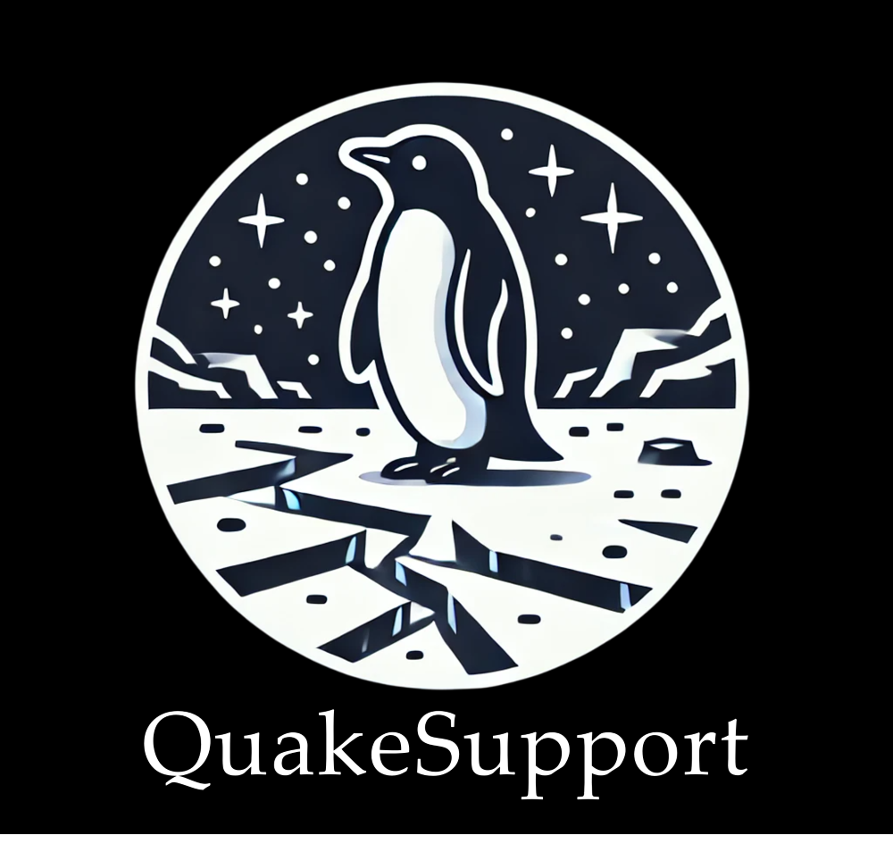

# QuakeSupport
Python package for streamlining end-to-end QuakeMigrate processing with GrowClust integration.

For detailed instructions on installation, tuning, running, and testing, please refer to the [documentation](https://github.com/cryoilrj/QuakeSupport/blob/main/docs/QuakeSupport%20User%20Guide.pdf).

QuakeSupport was developed to address key challenges in our Rutford Ice Stream icequakes project, particularly in efficiently processing extended time periods in QuakeMigrate and integrating its outputs with GrowClust. This work builds on the robust foundation established by the QuakeMigrate and GrowClust developers, expanding their capabilities rather than replicating them, thereby benefiting downstream users. QuakeSupport is not a standalone system but an extension designed to enhance processing, streamline workflows, and improve compatibility, ensuring these powerful tools work together even more effectively.

QuakeSupport is maintained as needed to ensure ongoing compatibility with QuakeMigrate and GrowClust updates. Additional functionalities and improvements may be considered, particularly if similar features are not already incorporated into QuakeMigrate or GrowClust. For suggestions and comments, contact **Ian Lee** at [ianrj.lee@gmail.com](mailto:ianrj.lee@gmail.com).

